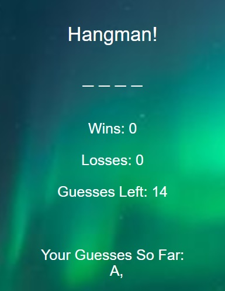

# Hangman-Game

The Hangman Game is about guessing letters in a random word. The game interface is within the game tag. The Hangman Game has blanks where the letters can appear if each letter is correctly chosen.

The CODE: document.querySelector("#game").innerHTML = html ----- puts the variables within the game tag. 

THE CODE: document.onkeyup = function (event) ----- initiates a function when a key is pressed

The variables include: wins, losses, guesses & used_letters